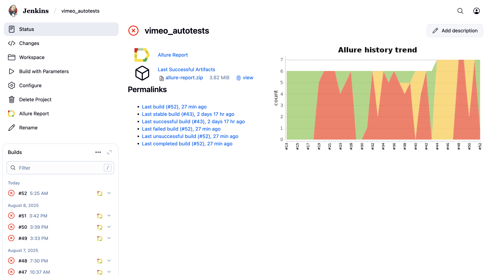
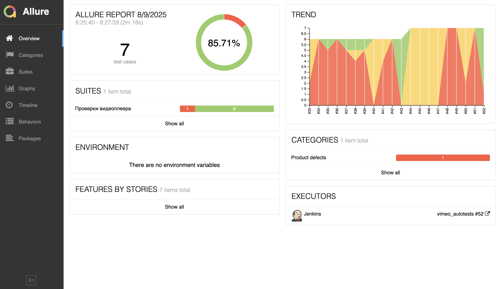
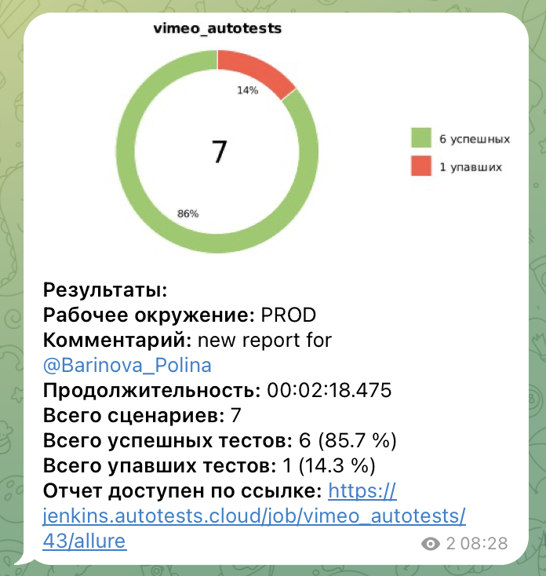
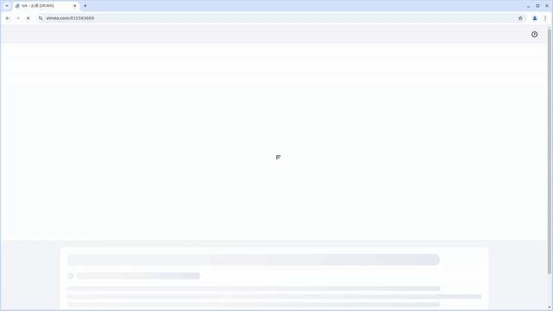

<a href="https://vimeo.com/ ">  
<h2 >Проект по автоматизации тестирования для компании <a href="https://vimeo.com/ "> Vimeo </a></h2> 

## Содержание:

- Технологии и инструменты
- Список проверок, реализованных в тестах
- Запуск тестов (сборка в Jenkins) и из терминала
- Allure-отчет
- Уведомление в Telegram о результатах прогона тестов
- Видео пример прохождения тестов

<a id="tools"></a>
## Технологии и инструменты:

|         Java                                                                                                      | IntelliJ  <br>  Idea                                                                                               | GitHub                                                                                                     | JUnit 5                                                                                                           | Gradle                                                                                                     | Selenide                                                                                                         | Selenoid                                                                                                                  | Allure <br> Report                                                                                                         |  Jenkins                                                                                                        |   Telegram
|:----------------------------------------------------------------------------------------------------------|--------------------------------------------------------------------------------------------------------------------|------------------------------------------------------------------------------------------------------------|-------------------------------------------------------------------------------------------------------------------|------------------------------------------------------------------------------------------------------------|------------------------------------------------------------------------------------------------------------------|---------------------------------------------------------------------------------------------------------------------------|----------------------------------------------------------------------------------------------------------------------------|-----------------------------------------------------------------------------------------------------------------|---------------------------------------------------------------------------------------------------------------------|
| <a href="https://www.java.com/"></a>  | <a href="https://www.jetbrains.com/idea/"></a> | <a href="https://github.com/"></a> | <a href="https://junit.org/junit5/"></a> | <a href="https://gradle.org/"></a> | <a href="https://selenide.org/"></a> | <a href="https://aerokube.com/selenoid/"></a> | <a href="https://github.com/allure-framework"></a> |<a href="https://www.jenkins.io/"></a> | <a href="https://web.telegram.org/"></a> |<a href="https://qameta.io/"></a> |

<a id="cases"></a>
## Реализованные проверки:
1.UI-тесты видеоплеера:
- Воспроизведение видео
- Остановка воспроизведения видео
- Перемотка вперед клавиатурой
- Перемотка назад клавиатурой
- Перемотка вперед ползунком
- Перемотка назад ползунком

##  Сборка в [Jenkins](https://jenkins.autotests.cloud/job/vimeo_autotests/)


<p align="center">  
</a>  
</p>


## Параметры сборки в Jenkins:

При запуске сборки в **Jenkins** можно использовать следующие параметры:

- `BROWSER` — браузер, **по умолчанию** `chrome`
- `BROWSER_VERSION` — версия браузера, **по умолчанию** `128.0`
- `BROWSER_SIZE` — размер окна браузера, **по умолчанию** `1920x1080`
- `SELENOID_LOGIN` и `SELENOID_PASSWORD` — логин и пароль для доступа к Selenoid
- `SELENOID_URL` — адрес сервера Selenoid
- `TASK` — выбор тестов для запуска, **по умолчанию** `test`


## Команда для запуска из терминала
Локальный запуск
```bash
gradle clean test
```
Удаленный запуск через Jenkins:
```bash  
clean
${TASK}
"-Dselenoid.url=${SELENOID_URL}"
-Dselenoid.login=${SELENOID_LOGIN}
-Dselenoid.password=${SELENOID_PASSWORD}
"-Dbrowser=${BROWSER}"
"-Dbrowser.version=${BROWSER_VERSION}"
"-Dbrowser.size=${BROWSER_SIZE}"
```

## </a>  <a name="Allure"></a>Allure [Report](https://jenkins.autotests.cloud/job/vimeo_autotests/30/allure/)	</a>


## Основная страница отчёта

<p align="center">  
  
</p>  

____
## </a> Уведомление в Telegram при помощи бота
____
<p align="center">  
  
</p>

____
## </a> Примеры видео выполнения тестов на Selenoid
____
<p align="center">
   
</p>
